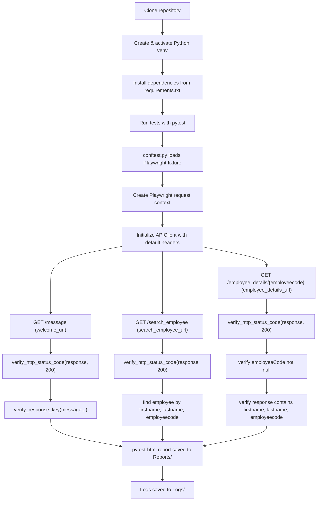

# Mentorship Portal API Automation Flow

This file describes the workflow for the `Mentorship_Portal_API_Automation` repository and shows how tests flow from setup to API verification and report generation.

## High-level Flow

## Components

- `Tests/test_mentorship.py`: main API test suite with three GET tests.
- `Utilities/api_client.py`: reusable wrapper for Playwright HTTP requests.
- `Utilities/api_url.py`: endpoint definitions and base URLs.
- `Utilities/headers.py`: default JSON request headers.
- `Utilities/variables.py`: employee test data used in search and details checks.
- `Utilities/common_verifications.py`: assertion helpers for status codes, JSON keys, and response content.
- `conftest.py`: configures the Playwright session fixture and pytest HTML report output.

## Key flow details

1. Clone the repository and set up a Python virtual environment.
2. Install dependencies with `pip install -r requirements.txt`.
3. Execute tests using `pytest` or `pytest Tests/test_mentorship.py`.
4. `conftest.py` starts Playwright and sets the HTML report path.
5. `Tests/test_mentorship.py` uses `APIClient` to call API endpoints.
6. Tests validate:
   - `GET /message`: status 200 and correct welcome message.
   - `GET /search_employee`: status 200 and expected employee exists.
   - `GET /employee_details/{employeecode}`: status 200 and response contains expected employee data.
7. Results are written to an HTML report in `Reports/` and runtime logs are saved in `Logs/`.

## Notes

- The diagram uses the actual URLs from `Utilities/api_url.py`.
- `Utilities/variables.py` stores the employee details used as expected verification values.
- This flow is intentionally simple and clear for understanding the repository behavior.
